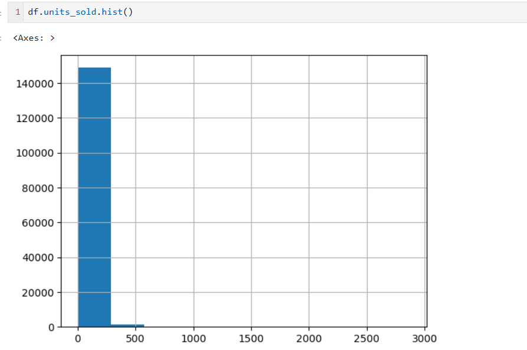
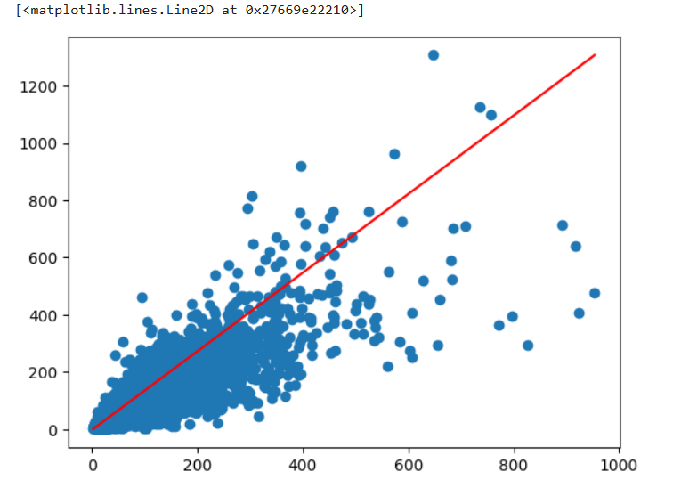
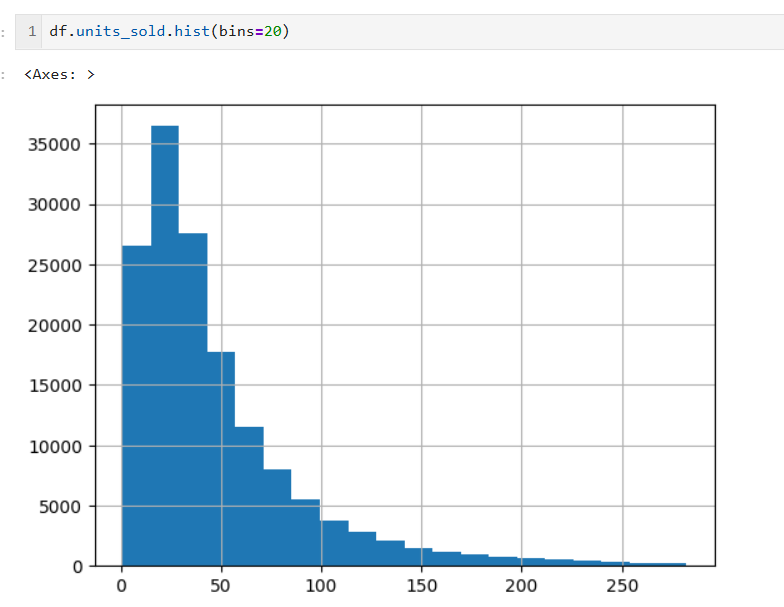
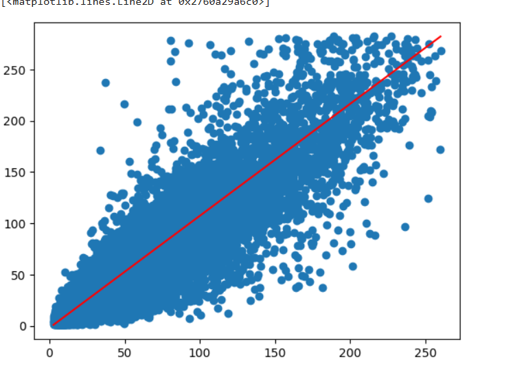

# 🚀 Store Sales Forecasting using Machine Learning

> End-to-End Data Science Project  
> From Raw Data → EDA → Feature Engineering → Modeling → Evaluation

---

## 📌 Project Overview

Accurate sales forecasting is critical for retail businesses to optimize inventory, reduce losses, and improve profitability.

This project builds a Machine Learning model to predict store sales based on historical data. The notebook demonstrates a complete ML workflow including data preprocessing, visualization, feature engineering, and model evaluation.

---

## 🎯 Business Objective

Retail stores face challenges such as:
- Overstocking
- Understocking
- Revenue fluctuations
- Poor demand planning

The goal of this project is to build a predictive model that estimates future sales accurately and supports data-driven decision-making.

---

## 📂 Project Structure

```
Store-Sales-Forecasting/
│
├── Store_Forecast.ipynb
├── data/
│   ├── train.csv
│   ├── test.csv
│
├── outputs/
│   ├── predictions.csv
│   ├── visualization.png
│
├── requirements.txt
└── README.md
```

---

## 🛠️ Tech Stack

- Python
- Pandas
- NumPy
- Matplotlib
- Seaborn
- Scikit-learn

---

## 🔎 Exploratory Data Analysis (EDA)

Performed:

- Missing value analysis
- Distribution analysis
- Outlier detection and treatment
- Sales trend visualization
- Correlation analysis


## 📊 Data Distribution

### 🔎 Before Processing

<p align="center">
  
  
</p>

---

### 📈 After Processing

<p align="center">
  
  
</p>

### Key Findings:

- Sales data showed positive skewness.
- Extreme outliers were present.
- Outlier treatment improved distribution clarity.
- Cleaned data improved modeling stability.

---

## 🧠 Feature Engineering

- Extracted date-based features (day, month, year)
- Handled categorical variables
- Removed extreme outliers
- Prepared data for regression modeling

---

## 🤖 Model Building

Trained and evaluated regression models including:

- Linear Regression
- Random Forest Regressor

### Evaluation Metrics Used:

- RMSE (Root Mean Squared Error)
- MAE (Mean Absolute Error)

- After Model training the Model Score becames **82.7% from 77%**
- The RMSE value becames **17 from 30**
- 
The final model showed improved performance after data preprocessing and feature engineering.

---

## 📊 Results

- Reduced RMSE after outlier handling
- Improved generalization
- Better prediction stability

---

## 🚀 Future Improvements

- Hyperparameter tuning
- XGBoost / LightGBM implementation
- Log transformation for skewed data
- Model deployment using Streamlit
- Docker containerization
- Cloud deployment (AWS / GCP)

---

## 💼 Skills Demonstrated

- Data Cleaning
- Exploratory Data Analysis
- Statistical Understanding
- Feature Engineering
- Machine Learning Modeling
- Model Evaluation
- Problem Solving
